prisma-erd-generator generates duplicate relationship lines

See below for instructions on updating the diagrams without extra relationship lines

# Private Sessions



# Trusted Users


# User Keys


# Admin


### Updating the diagrams

Autogeneration is disabled because it generates additional lines.

If you need to update the diagrams, here's how you can do it:

Open the relevant schema.prisma file, uncomment
the ERD generator lines at the bottom, and then do

```bash
# Change for a different service
cd services/private-sessions
ERD_DEBUG=true npx prisma generate
```

Then:

1. Take note of the command it outputs, and open the .mmd file that it specifies
2. Remove the extraneous relations that it add
3. Re-run the command it output
